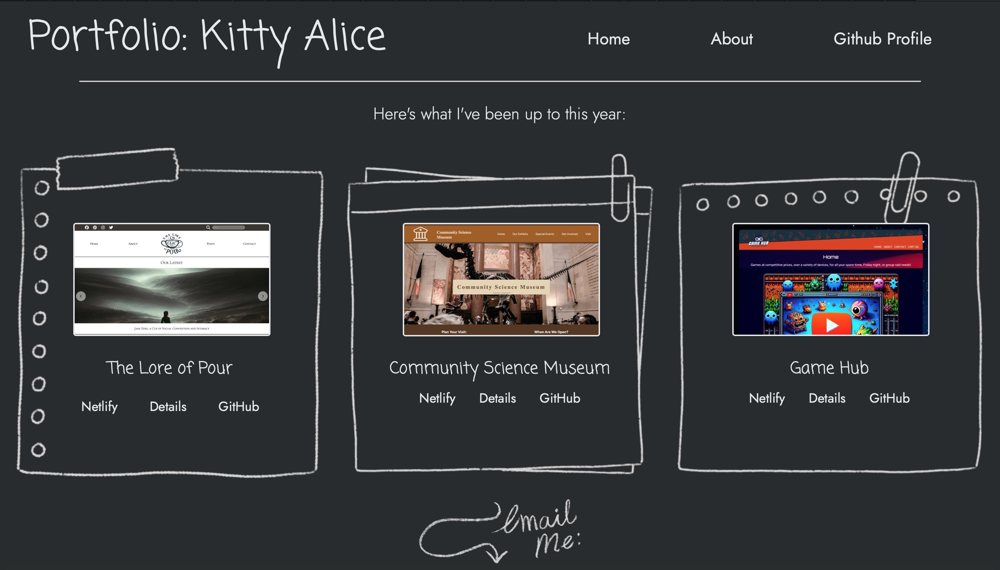
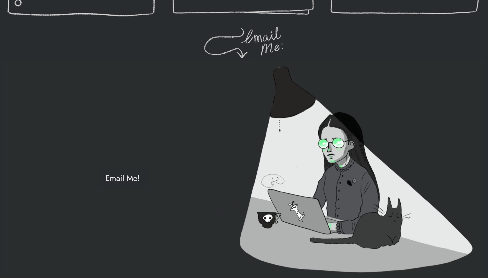
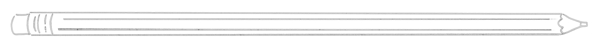

---

---

# Portfolio- Documenting our work so far: 

Our portfolio was a functional reflection project- and the first where we were introduced to the idea of README.md files.
This piece of work was to combine all of our significant projects so far, and display them on a page we had built and designed as a portfolio.
Though my design was an experiment, and one I was admittedly a little insecure about- I do enjoy that this piece of work was to illustrate how we are as people and coders.
The portfolio was built to be able to add more work as time passed and the volume of our work increased. 

Our Brief:

    Brief

    In this assignment, you will be documenting three prior submissions from the first year:
    Your cross-course project
    Semester Project 1
    Project Exam 1
    You will be creating a README.md file at the root of each of these projects and then documenting the submissions following a given format.

    You will then also be creating a README.md for your own personal GitHub profile.

    Lastly, you will be creating a portfolio webpage that lists these 3 projects.

    This page must:
    List the 3 projects as cards
    Each card must have:
    the title of the project,
    a description,
    a screenshot of how the project looks when running,
    a link to the GitHub repo and a live site if it is online.

## Site purpose:

To show links to all of our work so far, as a page a small "us", and a great big "This is what we do!".
Here's looking at you Neil Amstrong.

### Description

-- Home Page

Our home page was meant to introduce the site adequately, so at a glance it was obvious what the site did- 
Thous would be via a title or to introduce the games- i tried to do both.
This page should be easily to navigate through, and show clear options to view ore details about the games being sold. 

-- About Page 

The user should have the option to click on one of the games displayed either on the home page, or a page where a selection of the games can be viewed, and be taken to a page the displays more information- 

---

** Note **

No Tech used so far- Pure CSS, HTML, and JavaScript- will update if this changes

 

#### Getting Started

Installing

Clone the repo:

    git clone git@github.com: https://github.com/AutopsyTurvy/GameHub-KittyAliceCase.git

Install the dependencies: N/A

    npm install

Running

To run the app, run the following commands:

    npm run start

(You may also choose to add to/ clone this code in another way than through the command line or terminal, and you may do this by opening it in your chosen code editor, via GitHub desktop, and subsequently, VScode. )

---

Contributing

Contributions are welcome, but I would request that the invidicual that does so, clones the code and adds notes so that I can review any changes before they are comitted to the project permanently. Thank you! 

---

Contact:

Email me: 
autopsyturvycoding@gmail.com

 

Find me on Discord:
(Kitty Alice Case
kittyalicerayworth)

---

Acknowledgments

Thanks to my dear friend Jamie, who explained so much to me. 
